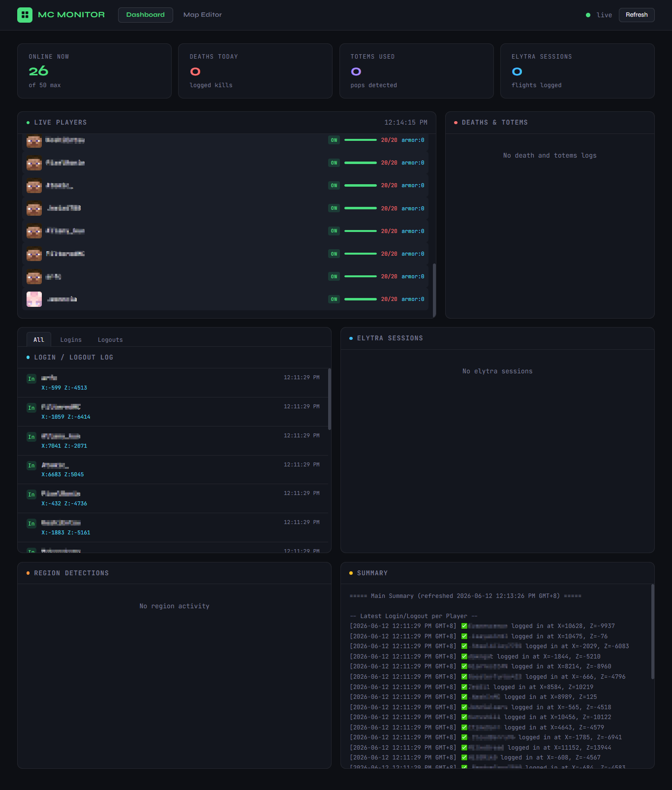
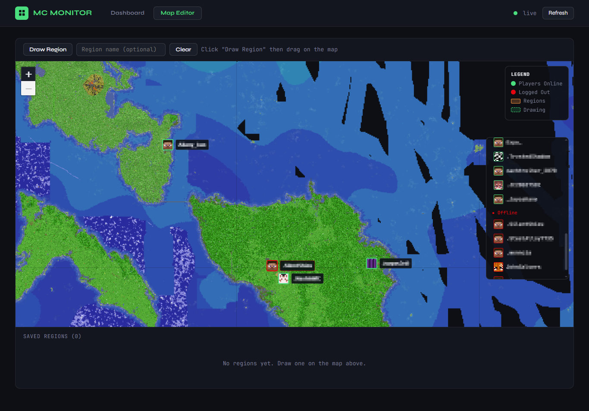

# Squaremap-Minecraft-Monitor

A real-time Minecraft server player monitoring dashboard built with Flask and Leaflet.js. It polls a [Squaremap](https://github.com/jpenilla/squaremap) API to track and log player activity — logins, logouts, deaths, elytra flights, totem pops, and custom region entries — all displayed on a live map with a web dashboard.

> Designed for servers running Squaremap as their live map plugin.
---
 
## Features

- **Live player map** — shows online players, recently logged-out players, and dead players on a Squaremap tile overlay
- **Login / logout tracking** — logs session times and last known coordinates
- **Death detection** — detects player deaths on disconnect (health = 0) and logs nearby players
- **Totem detection** — detects totem-of-undying pops via health recovery patterns
- **Elytra flight detection** — tracks flight sessions with duration, distance, speed, and fireworks detection
- **Region monitoring** — draw custom bounding box regions on the map; get notified when players enter or leave
- **Player count logging** — logs when the server is at low player counts (0–3)
- **Summary view** — a live-refreshing summary of the latest state per player

---

## Requirements

- Python 3.8+
- A Minecraft server running [Squaremap](https://github.com/jpenilla/squaremap) with the web map accessible over HTTP

Install dependencies:

```bash
pip install -r requirements.txt
```

---

## Configuration

Set the following environment variable before running:

| Variable | Description | Default |
|---|---|---|
| `SQUAREMAP_HOST` | Base URL of your Squaremap instance | `http://localhost:7272` |
| `PORT` | Port to run the Flask app on | `8000` |

**Linux / macOS:**
```bash
export SQUAREMAP_HOST=http://your-server-ip:7272
python app.py
```

**Windows (Command Prompt):**
```cmd
set SQUAREMAP_HOST=http://your-server-ip:7272
python app.py
```

**Windows (PowerShell):**
```powershell
$env:SQUAREMAP_HOST = "http://your-server-ip:7272"
python app.py
```

---

## Running

```bash
python app.py
```

Then open your browser to `http://localhost:8000`.

---

## Dashboard

The dashboard has two tabs:

**Dashboard tab** — live panels for:
- Online players with health and armor bars
- Deaths and totem events
- Login / logout log (filterable)
- Elytra flight sessions (click an entry to draw the flight path on the map)
- Region detections
- Summary of latest player states

**Map Editor tab** — a Leaflet.js map powered by Squaremap tiles with:
- Live player markers (green = online, orange = dead, red = logged out)
- Draw custom regions directly on the map by dragging
- Region list with editable names and delete buttons
- Regions are saved server-side to `data/regions.json` and persist across restarts

---

## Log Files

All logs are written to the `logs/` directory:

| File | Contents |
|---|---|
| `logins_logouts.txt` | Login and logout events with coordinates and session duration |
| `deaths_log.txt` | Death and totem events |
| `planes_log.txt` | Elytra flight sessions |
| `region_detections.txt` | Region entry and exit events |
| `player_count.txt` | Low player count windows (0–3 players) |
| `main.txt` | Rolling summary — latest login, plane, and count state per player |

Logs are also accessible via HTTP endpoints:

| Endpoint | Contents |
|---|---|
| `/logs/l` | Login / logout log |
| `/logs/d` | Deaths and totems |
| `/logs/p` | Elytra flights |
| `/logs/r` | Region detections |
| `/logs/c` | Player counts |
| `/logs/main` | Summary |
| `/logs/js` | Summary as JSON |

---

## API Endpoints

| Endpoint | Method | Description |
|---|---|---|
| `/tiles/players.json` | GET | Proxied player data from Squaremap |
| `/map-tile/<zoom>/<x>/<z>.png` | GET | Proxied Squaremap map tiles |
| `/api/logout-state` | GET | Last known state of logged-out players |
| `/api/dead-players` | GET | Players currently in death state (20s window) |
| `/api/regions` | GET | All saved regions |
| `/api/regions` | POST | Save regions (JSON array) |
| `/api/world-bounds` | GET | Dynamic world bounds based on player positions |

---

## Elytra Detection

The elytra detection system works by analyzing horizontal speed, descent rate, and flight duration from Squaremap position data polled at 0.5s intervals. It uses the following thresholds (tuned to match official Minecraft mechanics):

| Parameter | Value | Notes |
|---|---|---|
| Entry speed | ≥ 14.0 blk/s | Matches Minecraft stall speed (~14.4 m/s) |
| Exit speed | ≤ 2.0 blk/s | Conservative exit threshold |
| Min duration | 3 seconds | Filters out lag artifacts |
| Min distance | 50 blocks | Filters out noise and accidental triggers |
| Descent range | -0.01 to -10.0 blk/s | Valid glide descent rate |
| Fireworks speed spike | > 25.0 blk/s | Flags powered flight |
| Fireworks altitude gain | > 2.0 blocks | Secondary fireworks indicator |

See [`ELYTRA_DETECTION_ANALYSIS.md`](ELYTRA_DETECTION_ANALYSIS.md) for a full breakdown of the detection logic, threshold validation against wiki data, and improvement recommendations.

---

## Project Structure

```
app.py                        # Flask backend — tracking, detection, API routes
dashboard.html                # Frontend dashboard and map editor
requirements.txt              # Python dependencies
data/
  regions.json                # Saved region definitions (persists across restarts)
logs/                         # Runtime log files (auto-created, not committed)
ELYTRA_DETECTION_ANALYSIS.md  # Elytra detection design document
```

---

## Notes

- The server polls Squaremap every 0.5 seconds. Squaremap itself updates player positions every ~1 second, so some reads will be stale (handled via position-change detection).
- Player avatars are loaded from [mc-heads.net](https://mc-heads.net) using UUID or username.
- All times are logged in GMT+8.
- The `data/regions.json` file is tracked in git so your regions persist. Log files in `logs/` are not tracked.
